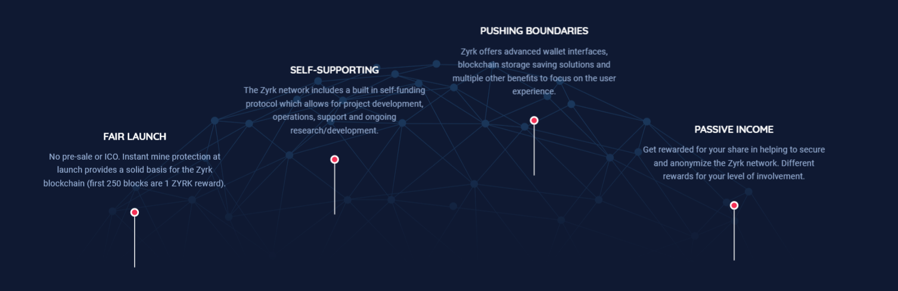
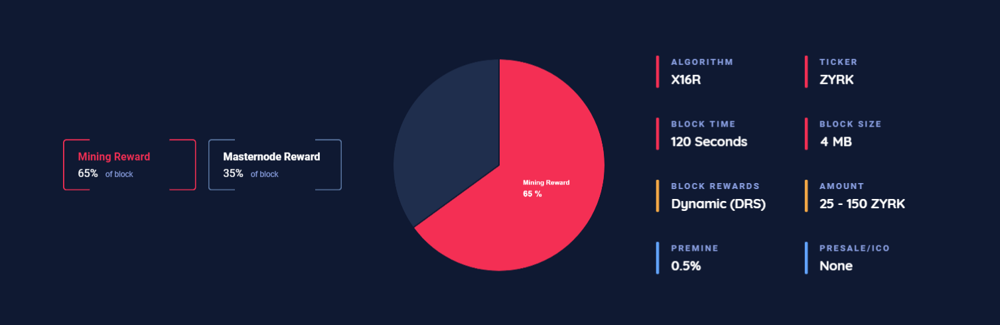
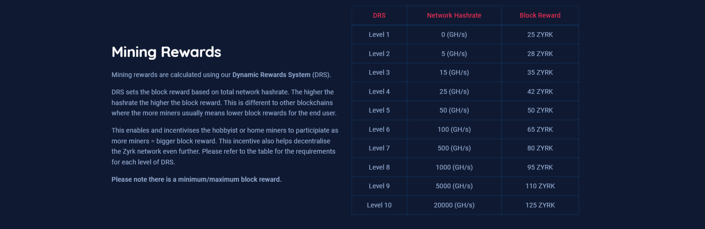

  

                                                                                                                                                     
[Website](https://zyrk.io) — [Block Explorer](https://explorer.zyrk.io/) — [Blog](https://news.zyrk.io) — [Forum](https://bitcointalk.org/) — [Discord](https://discord.gg/QHRk9NF) — [Twitter](https://twitter.com/ProjectZyrk)

Development Process
-------------------

The `master` branch is regularly built and tested, but is not guaranteed to be
completely stable. [Tags](https://github.com/ZyrkProject/zyrk-core/tags) are created
regularly to indicate new official, stable release versions of Zyrk.

The contribution workflow is described in [CONTRIBUTING.md](CONTRIBUTING.md).

Testing
-------

Testing and code review is the bottleneck for development; we get more pull
requests than we can review and test on short notice. Please be patient and help out by testing
other people's pull requests, and remember this is a security-critical project where any mistake might cost people
lots of money.

### Automated Testing

Developers are strongly encouraged to write [unit tests](src/test/README.md) for new code, and to
submit new unit tests for old code. Unit tests can be compiled and run
(assuming they weren't disabled in configure) with: `make check`. Further details on running
and extending unit tests can be found in [/src/test/README.md](/src/test/README.md).

There are also [regression and integration tests](/qa) of the RPC interface, written
in Python, that are run automatically on the build server.
These tests can be run (if the [test dependencies](/qa) are installed) with: `qa/pull-tester/rpc-tests.py`

### Manual Quality Assurance (QA) Testing

Changes should be tested by somebody other than the developer who wrote the
code. This is especially important for large or high-risk changes. It is useful
to add a test plan to the pull request description if testing the changes is
not straightforward.

### Issue

 We try to prompt our users for the basic information We always need for new issues.
 Please fill out the issue template below and submit an issue on the zyrk-core github page.
 
 [ISSUE_TEMPLATE](doc/template/ISSUE_TEMPLATE_example.md)

 ### References/Copyrights

* Copyright (c) 2019 [Bitcoin Core](https://github.com/bitcoin)
* Copyright (c) 2019 [Dash Core](https://github.com/dashpay)
* Copyright (c) 2019 [Verge Currency](https://github.com/vergecurrency)
* Copyright (c) 2019 [NIX Platform](https://github.com/nixplatform/)
* Copyright (c) 2019 [Particl Project](https://github.com/particl)
